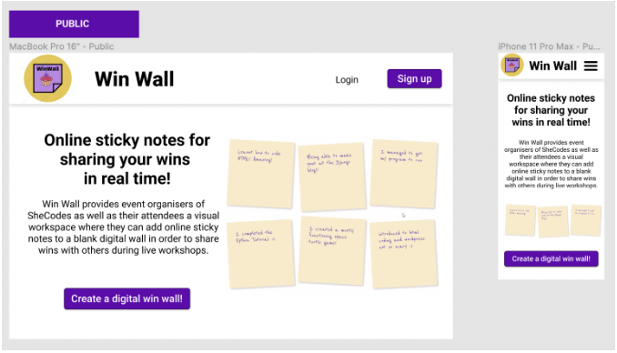
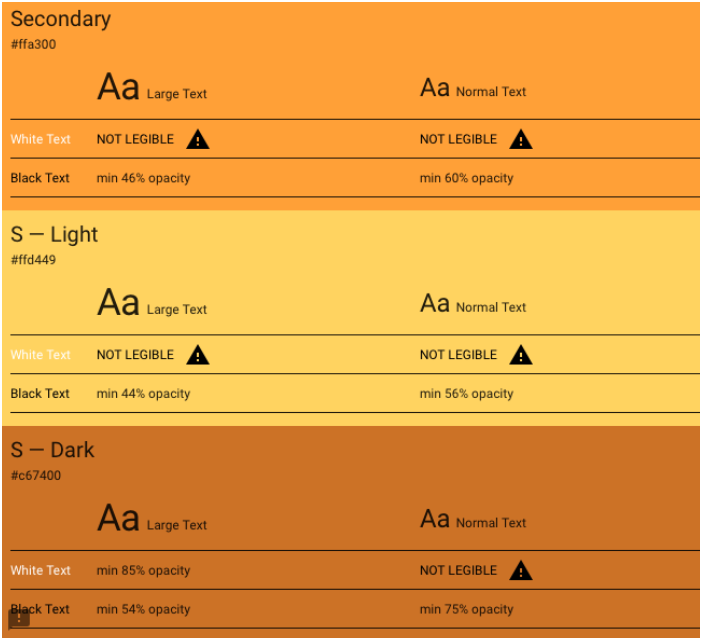

## Your Product Name

**Team Name:** Stack OTTERflows


### MEET THE TEAM


(From left to right): The Gals you OTTER hire ~ Becky Cole, Inano Knowles, Nancy Valentin, Mahounda Poinsonnet.


## Table of Contents

- [Your Product Name](#your-product-name)
  - [Table of Contents](#table-of-contents)
  - [Mission Statement](#mission-statement)
  - [Features](#features)
    - [Summary](#summary)
    - [Users](#users)
    - [Sticky Notes](#sticky-notes)
    - [Collections](#collections)
    - [Pages/Endpoint Functionality](#pagesendpoint-functionality)
    - [Nice To Haves](#nice-to-haves)
  - [Technical Implementation](#technical-implementation)
    - [Back-End](#back-end)
    - [Front-End](#front-end)
    - [Git \& Deployment](#git--deployment)
  - [Target Audience](#target-audience)
  - [Back-end Implementation](#back-end-implementation)
    - [API Specification](#api-specification)
    - [Object Definitions](#object-definitions)
      - [Users](#users-1)
      - [Sticky Notes](#sticky-notes-1)
    - [Database Schema](#database-schema)
  - [Front-end Implementation](#front-end-implementation)
    - [Wireframes](#wireframes)
      - [Home Page](#home-page)
      - [Collection List Page](#collection-list-page)
    - [Logo](#logo)
    - [Colours](#colours)
      - [Primary](#primary)
      - [Secondary](#secondary)
    - [Font](#font)


## Mission Statement

Accountability Pods empowers individuals to achieve meaningful goals through shared commitment and community support. 
Users join invite only groups centred on goals such as fitness, learning or career development. 
Through goal setting, regular check ins and progress tracking, the platform strengthens accountability while fostering motivation, engagement and the celebration of milestones together.

## Features

> [!NOTE]  
> The features outlined below are subject to change in response to client feedback, evolving project requirements, or development constraints.

### Summary

Accountability Pods by Stack Otterflow enables users to manage personal and collective goal tracking through structured groups. 
Members submit check-ins for verification by designated "buddies" or pod members, ensuring data integrity and community support. 
Administrative roles oversee pod settings and membership, while a centralised dashboard visualises individual and group progress through real-time streak tracking and milestone celebrations.

### Users

| Type | Access | Role type assignment |
|------|------|------|
| Superuser or admin | - All access<br>- Can log in<br>- Can log out<br>- Create and manage pods<br>- Create and manage goal categories<br>- Create and manage other users<br>- Approve, archive, and edit check-ins<br>- Export data as CSV<br>- Can see and edit their details via profile page | Core Team: Becky, Inano, Nancy, and Mahounda |
| Approver | - Can log in<br>- Can log out<br>- Approve, archive, and edit check-ins within assigned pods<br>- Manage pod membership requests<br>- Can see and edit their details via profile page | Client: Lachlan; Mentors, volunteers, She Codes staff |
| Member | - Create and submit check-ins<br>- Join pods and set personal goals<br>- View pod dashboards and activity feeds<br>- Verify buddy progress<br>- Can see and edit their details via profile page | Registered users, students, professionals |
| Guest | - View landing page<br>- Browse public pods (read-only)<br>- Access registration and login pages | Public: Users interested in joining a pod |

### Sticky Notes

| Feature | Access | Notes/Conditions |
|---|---|---|
| Create | Members | - Log progress against an active personal or pod goal<br>- Option to include hashtags or categories (e.g., #fitness, #coding) |
| Post | Members | - Submits progress to the Pod activity feed<br>- Triggers a "Pending" status for verification |
| View | Members, Approvers, and Admins | - Members view via Pod Dashboard feed<br>- Admins/Approvers view via "Pending Verification" queue |
| Edit | Admins and Approvers | - Correct entry errors or adjust values before verification<br>- Ensure data integrity before the status is set to "Approved" |
| Statuses: Pending, Approved, Rejected, Archived | - Auto-status: Check-ins are "Pending" upon submission<br>- Verification: Updated to "Approved" or "Rejected" by Admins/Approvers or assigned Buddies | - Status change updates the goal progress bar and user streaks |
| Export | Admin only | - Export as CSV file<br>- Format: pod_name, goal_title, member_name, checkin_value, timestamp |
| Flag: Is Verified | Auto-flag | - Boolean: True once an Admin or Approver has finalised the check-in status |
| Link to Pod | Members | - Check-ins are automatically linked to the Pod from which they were submitted |
| Link to Goal | Members | - Users must select which specific Goal the check-in contributes towards |
| Link to Approver | Admin / Approver | - Records which Admin, Approver, or Buddy authorised the check-in for audit purposes |

### Collections

| Feature | Scope | Access | Notes / Conditions |
|---|---|---|---|
| Assign Pods to a Category | Group | Based on Pod topic | - Pods are grouped under a thematic category (e.g., "Coding", "Fitness", "Career Development").<br>- Helps organise pods on the Explore page and improves discoverability for members searching for relevant communities.<br>- Categories support easier filtering and navigation across the platform. |
| Assign Approver to a Category | Group | Admin (Core Team) | - Allows an Admin to assign an Approver (e.g., Lachlan or designated staff/mentors) responsibility for pods within a specific category.<br>- The assigned Approver can review, verify, and moderate check-ins for pods under that category.<br>- Helps distribute moderation responsibilities and ensures subject-matter oversight. |
| Default Goal Duration | Group | Admin (Core Team) | - Defines the standard cadence for goals created within pods of that category (e.g., Weekly, Monthly).<br>- Provides consistency across pods in the same theme and helps members track progress more effectively.<br>- Admins can configure these defaults when setting up or managing categories. |
| View Pod Dashboards by Category | Group | Admin, Approver | - Enables Admins and Approvers to view aggregated dashboards for all pods within a category.<br>- Displays progress summaries, member activity, and recent check-ins across multiple pods.<br>- Useful for monitoring engagement and identifying trends within a specific theme. |
| Export Check-ins by Category | Group | Admin (Core Team) | - Generates CSV reports containing check-in data filtered by Pod Category.<br>- Exported fields may include pod name, goal title, member name, check-in value, and timestamp.<br>- Supports reporting, analytics, and internal review by the Core Team. |
| Set Personal Goal | Individual | Members | - Each member defines their own target (e.g., "3 study sessions per week").<br>- Targets can vary between members even if they belong to the same pod.<br>- Personal goals contribute to individual progress tracking and accountability. |
| Private Progress | Individual | Members | - Check-ins contribute to a personal progress bar visible to the member.<br>- Personal streaks are calculated based on the individual's consistency.<br>- Encourages motivation through private goal tracking separate from pod-level metrics. |
| Buddy Assignment | Individual | Members / Admin | - Each member may be paired with a "Buddy" responsible for verifying their specific check-ins.<br>- Buddies help maintain accountability and ensure check-ins reflect genuine progress.<br>- Admins may override or assign buddies where necessary. |
| Member Leaderboard | Group | Pod Members | - Displays a ranking or list of members who have met or exceeded their personal targets for the current period.<br>- Encourages friendly competition and community engagement within the pod.<br>- Leaderboards may reset periodically (e.g., weekly or monthly). |
| Personalised Notifications | Individual | Members | - Automated reminders are sent based on the individual's goal deadlines.<br>- Notifications may include reminders to submit check-ins, progress updates, or streak alerts.<br>- Helps members stay consistent with their commitments. |

### Pages/Endpoint Functionality

| Endpoint | Functionality | Comments |
|---|---|---|
| Submit Check-in | - Members post progress updates to their Pod<br>- Toggle for Individual vs Group goal contribution<br>- Option to add numeric values, notes, and hashtags | - Sticky note style interface preferred for quick posting<br>- High contrast design and mobile responsive layout<br>- Real time character limit validation to guide concise updates |
| Pod Dashboard (Live Board) | - View live feed of check-in sticky notes<br>- Visualise progress bars (Individual streaks or Group totals)<br>- Search notes by text, member, or hashtag<br>- Daily cadences reset at midnight AEST | - Designed to feel like an interactive live board session<br>- Progress bars update dynamically when new check-ins are submitted<br>- Toggle between Individual progress view and Group progress view |
| Admin Dashboard | - All Superuser functions (Becky, Inano, Nancy, Mahounda)<br>- Create and manage Pod Categories (Collections)<br>- Manage all users and global system settings<br>- Export all data by Category or Pod as CSV | - Requires Superuser authentication<br>- Initial admin accounts created through database seed configuration during deployment |
| Register as Approver | - Users (Lachlan, Mentors) can register for oversight permissions<br>- Once approved they can log in to the Verification Queue | - Requires verified She Codes email address<br>- Final authorisation managed by the Core Team |
| Approver / Client Page | - Approver functions for Lachlan and Mentors<br>- Verify, edit, or reject pending check-in notes<br>- View aggregated pod data by Category | - Requires Approver authentication<br>- Interface optimised for quickly reviewing and verifying large volumes of submissions |
| Individual Pod View | - Focus on personal targets and Buddy pairings<br>- View personal consistency streaks and milestone progress | - Designed to support personal accountability and goal tracking<br>- Accessible to all registered pod members |
| Group Pod View | - Collaborative view of a shared group target<br>- Progress bar increases when any member submits a valid check-in | - Emphasises collective success within the pod<br>- Encourages collaboration and group motivation |
| Profile Page | - Accessible by all registered users (Admins, Approvers, Members)<br>- View personal history of check-ins and earned badges<br>- Update account information and notification preferences | - Requires authentication<br>- Serves as the central hub for individual achievements and activity metrics |

### Nice To Haves

- **The "Nudge" System:** Automated notifications sent to a "Buddy" or Pod Admin if a member hasn't submitted a check-in within their defined timeframe.
- **Milestone Celebrations:** Interactive animations (e.g., confetti) or digital trophies triggered when a member hits a 7-day or 30-day consistency streak.
- **Pod Chat/Comments:** A dedicated space on the Pod Dashboard for members to leave words of encouragement on each other’s "sticky note" check-ins.
- **Public vs Private Pods:** The ability for members to create invite-only pods for sensitive goals or private coaching.
- **Interactive Charts:** Dynamic line graphs or heatmaps (similar to GitHub contribution calendars) to visualise activity trends over time.
- **Bulk Verification:** A "Select All" feature for Administrators to approve multiple pending check-ins simultaneously.
- **Custom Goal Metrics:** Allowing users to define unique units (e.g., "glasses of water" or "lines of code") instead of just binary "Done/Not Done" toggles.
- **Automated CSV Scheduling:** The ability for the Core Team to schedule weekly data exports to be sent directly to their email.
- **Dark Mode Toggle:** A high-contrast dark theme for users logging nightly check-ins.
- **Image Uploads:** Allowing members to attach a photo to their check-in card for extra proof of work (e.g., a photo of a completed gym session).
- **Mobile App Wrapper (PWA):** Allowing users to add Accountability Pods to their phone home screen for quicker access and "app-like" behaviour.
- **Leaderboard Filters:** The ability to filter pod rankings by "All Time," "This Month," or "This Week."
- **Calendar Sync:** Exporting pod deadlines and goal targets to external calendars like Google Calendar or Outlook.
- **Slack/Discord Integration:** Webhooks that post a notification to a specific channel whenever a Group Pod hits a major milestone.
- **Reaction Emojis/Assets:** Ability for buddies to react to check-in "sticky notes" with quick emojis to provide instant feedback.

## Technical Implementation

### Back-End

- Django / DRF API
- Python

### Front-End

- React / JavaScript
- HTML/CSS

### Git & Deployment
- Heroku
- Netlify
- GitHub

This application's back-end will be deployed to Heroku. The front-end will be deployed separately to Netlify.
 
We will also use Insomnia to ensure API endpoints are working smoothly (we will utilise a local and deployed environment in Insomnia).

## Target Audience

This website has one major target audience within a broad age range: individuals who want to be held accountable for their goals, whether professional or personal, by their peers and mentors.

Core Team and Client (administrators) will use this website to manage pod categories, oversee global progress, and manage user roles. 

The administrators will be able to sort, authorise, and delete check-ins and easily download the data in a CSV file. 

This website is targeted towards this group to automate the oversight of multiple accountability groups and streamline data collection for reporting.

Pod Members (laypeople) will use this website to post their progress on a "sticky note" style dashboard, keep track of their personal or group goals, and maintain consistency streaks. 

This website is targeted to this group in order to provide a central, interactive space for digital accountability, preventing the loss of manual tracking data and fostering community motivation.

## Back-end Implementation
### API Specification

### Authentication

| HTTP Method | Endpoint | Purpose | Request Body | Success Code | Authorisation |
|---|---|---|---|---|---|
| POST | `/auth/register` | Register a new user account | `{ "username": "string", "full_name": "string", "email": "string", "password": "string", "role": "member/approver" }` | 201 | Public |
| POST | `/auth/login` | Authenticate a user and return an access token | `{ "email": "string", "password": "string" }` | 200 | Public |
| POST | `/auth/logout` | Log out the current user and invalidate their session/token | NA | 200 | Authenticated user |
| GET | `/auth/me` | Return the currently logged-in user's profile | NA | 200 | Authenticated user |

### Users

| HTTP Method | Endpoint | Purpose | Request Body | Success Code | Authorisation |
|---|---|---|---|---|---|
| GET | `/users` | Retrieve all users | NA | 200 | Admin |
| GET | `/users/{id}` | Retrieve a specific user profile | NA | 200 | Admin or authenticated user |
| PUT | `/users/{id}` | Update a user's profile | `{ "full_name": "string", "email": "string", "avatar": "string", "bio": "string", "social_link": "string" }` | 200 | Admin or matching user |
| DELETE | `/users/{id}` | Deactivate or remove a user account | NA | 200 | Admin |

### Roles

| HTTP Method | Endpoint | Purpose | Request Body | Success Code | Authorisation |
|---|---|---|---|---|---|
| GET | `/roles` | Retrieve available system roles | NA | 200 | Admin |
| GET | `/roles/{id}` | Retrieve a specific role definition | NA | 200 | Admin |

### Categories

| HTTP Method | Endpoint | Purpose | Request Body | Success Code | Authorisation |
|---|---|---|---|---|---|
| GET | `/categories` | Retrieve all pod categories | NA | 200 | Authenticated user |
| GET | `/categories/{id}` | Retrieve a single category | NA | 200 | Authenticated user |
| POST | `/categories` | Create a new category | `{ "title": "string", "description": "string", "approver_id": integer, "default_goal_duration": "string" }` | 201 | Admin |
| PUT | `/categories/{id}` | Update a category | `{ "title": "string", "description": "string", "approver_id": integer, "default_goal_duration": "string" }` | 200 | Admin |
| DELETE | `/categories/{id}` | Archive or remove a category | NA | 200 | Admin |
| GET | `/categories/{id}/pods` | Retrieve all pods within a category | NA | 200 | Authenticated user |
| GET | `/categories/{id}/checkins/export` | Export category check-ins as CSV | Optional query params: `status`, `from`, `to` | 200 | Admin |

### Pods

| HTTP Method | Endpoint | Purpose | Request Body | Success Code | Authorisation |
|---|---|---|---|---|---|
| GET | `/pods` | Retrieve all pods | Optional query params: `category_id`, `goal_type`, `status` | 200 | Authenticated user |
| GET | `/pods/{id}` | Retrieve details for a single pod | NA | 200 | Authenticated user |
| POST | `/pods` | Create a new pod | `{ "title": "string", "category_id": integer, "goal_type": "individual/group", "start_date": "datetime", "end_date": "datetime" }` | 201 | Admin or Approver |
| PUT | `/pods/{id}` | Update a pod | `{ "title": "string", "category_id": integer, "goal_type": "individual/group", "start_date": "datetime", "end_date": "datetime" }` | 200 | Admin or Approver |
| DELETE | `/pods/{id}` | Archive or remove a pod | NA | 200 | Admin |
| POST | `/pods/{id}/join` | Join a pod | NA | 200 | Member |
| POST | `/pods/{id}/leave` | Leave a pod | NA | 200 | Member |
| GET | `/pods/{id}/members` | Retrieve all members of a pod | NA | 200 | Authenticated user |
| GET | `/pods/{id}/dashboard` | Retrieve live dashboard data for a pod | NA | 200 | Authenticated user |
| GET | `/pods/{id}/leaderboard` | Retrieve member leaderboard for a pod | NA | 200 | Pod members, Approver, Admin |

### Goals

| HTTP Method | Endpoint | Purpose | Request Body | Success Code | Authorisation |
|---|---|---|---|---|---|
| GET | `/goals` | Retrieve goals | Optional query params: `pod_id`, `user_id`, `type` | 200 | Authenticated user |
| GET | `/goals/{id}` | Retrieve a single goal | NA | 200 | Authenticated user |
| POST | `/goals` | Create a new goal | `{ "pod_id": integer, "user_id": integer, "title": "string", "target_value": integer, "cadence": "daily/weekly/monthly", "goal_type": "individual/group" }` | 201 | Member, Approver, Admin |
| PUT | `/goals/{id}` | Update a goal | `{ "title": "string", "target_value": integer, "cadence": "daily/weekly/monthly" }` | 200 | Goal owner, Approver, Admin |
| DELETE | `/goals/{id}` | Archive or remove a goal | NA | 200 | Goal owner, Admin |

### Check-ins

| HTTP Method | Endpoint | Purpose | Request Body | Success Code | Authorisation |
|---|---|---|---|---|---|
| GET | `/checkins` | Retrieve check-ins | Optional query params: `pod_id`, `category_id`, `user_id`, `status`, `from`, `to` | 200 | Authenticated user |
| GET | `/checkins/{id}` | Retrieve a specific check-in | NA | 200 | Authenticated user |
| POST | `/checkins` | Submit a new check-in | `{ "pod_id": integer, "goal_id": integer, "value": integer, "comment": "string", "hashtags": ["string"], "contribution_type": "individual/group" }` | 201 | Pod member |
| PUT | `/checkins/{id}` | Edit a check-in | `{ "value": integer, "comment": "string", "hashtags": ["string"] }` | 200 | Admin or Approver |
| PUT | `/checkins/{id}/status` | Approve, reject, or archive a check-in | `{ "status": "pending/approved/rejected/archived", "review_comment": "string" }` | 200 | Admin, Approver, Buddy |
| GET | `/checkins/export` | Export check-ins as CSV | Optional query params: `pod_id`, `category_id`, `status` | 200 | Admin |

### Verification Queue

| HTTP Method | Endpoint | Purpose | Request Body | Success Code | Authorisation |
|---|---|---|---|---|---|
| GET | `/verification-queue` | Retrieve all pending check-ins requiring review | Optional query params: `category_id`, `pod_id` | 200 | Approver, Admin |
| GET | `/verification-queue/{id}` | Retrieve a pending check-in for review | NA | 200 | Approver, Admin |
| POST | `/verification-queue/{id}/approve` | Approve a pending check-in | `{ "review_comment": "string" }` | 200 | Approver, Admin, assigned Buddy |
| POST | `/verification-queue/{id}/reject` | Reject a pending check-in | `{ "review_comment": "string" }` | 200 | Approver, Admin, assigned Buddy |

### Buddy System

| HTTP Method | Endpoint | Purpose | Request Body | Success Code | Authorisation |
|---|---|---|---|---|---|
| GET | `/buddies` | Retrieve buddy assignments | Optional query params: `user_id`, `pod_id` | 200 | Authenticated user |
| POST | `/buddies` | Assign a buddy to a member | `{ "member_id": integer, "buddy_id": integer, "pod_id": integer }` | 201 | Admin or Approver |
| PUT | `/buddies/{id}` | Update a buddy assignment | `{ "buddy_id": integer }` | 200 | Admin or Approver |
| DELETE | `/buddies/{id}` | Remove a buddy assignment | NA | 200 | Admin or Approver |

### Notifications

| HTTP Method | Endpoint | Purpose | Request Body | Success Code | Authorisation |
|---|---|---|---|---|---|
| GET | `/notifications` | Retrieve a user's notifications | NA | 200 | Authenticated user |
| PUT | `/notifications/preferences` | Update notification settings | `{ "email_notifications": true, "reminder_frequency": "daily/weekly", "deadline_alerts": true }` | 200 | Authenticated user |

### Dashboard and Analytics

| HTTP Method | Endpoint | Purpose | Request Body | Success Code | Authorisation |
|---|---|---|---|---|---|
| GET | `/dashboard/admin` | Retrieve global system dashboard metrics | NA | 200 | Admin |
| GET | `/dashboard/approver` | Retrieve category and pod moderation metrics | NA | 200 | Approver |
| GET | `/dashboard/member` | Retrieve personal progress, streaks, and milestones | NA | 200 | Member |
| GET | `/analytics/categories/{id}` | Retrieve aggregated analytics for a category | NA | 200 | Admin, Approver |
| GET | `/analytics/pods/{id}` | Retrieve aggregated analytics for a pod | NA | 200 | Admin, Approver |

## Example API Objects

```json
{
  "user": {
    "user_id": 1,
    "username": "jane_doe",
    "full_name": "Jane Doe",
    "email": "jane@example.com",
    "role_id": 3,
    "avatar": "https://example.com/avatar.jpg",
    "bio": "Aspiring software developer",
    "social_link": "https://github.com/janedoe"
  },
  "category": {
    "category_id": 1,
    "title": "Coding",
    "description": "Pods related to programming and technical study",
    "approver_id": 2,
    "default_goal_duration": "weekly",
    "is_exported": false
  },
  "pod": {
    "pod_id": 10,
    "title": "Python Pioneers",
    "category_id": 1,
    "goal_type": "group",
    "start_date": "2026-03-01T09:00:00Z",
    "end_date": "2026-03-31T23:59:59Z",
    "creator_id": 4
  },
  "goal": {
    "goal_id": 15,
    "pod_id": 10,
    "user_id": 4,
    "title": "Complete 3 Python practice sessions per week",
    "target_value": 3,
    "cadence": "weekly",
    "goal_type": "individual"
  },
  "check_in": {
    "checkin_id": 101,
    "user_id": 4,
    "pod_id": 10,
    "goal_id": 15,
    "value": 1,
    "comment": "Finished one Python practice session today",
    "hashtags": ["#python", "#study"],
    "status": "pending",
    "contribution_type": "individual",
    "created_at": "2026-03-07T10:30:00Z",
    "verified_by": null,
    "is_verified": false
  }
}
```
### Database Schema


## Front-end Implementation

### Wireframes

> [!NOTE]  
> Insert image(s) of your wireframes (could be a photo of hand-drawn wireframes or a screenshot of wireframes created using a tool such as https://www.mockflow.com/).

See all wireframes and how Admins, Approvers and Students would see the Win Wall website: https://www.figma.com/file/cvP0Kc7lAX39Fvo12C5aLa/Win-Wall?node-id=22%3A1345 

#### Home Page


#### Collection List Page


> [!NOTE]  
> etc...

### Logo


### Colours
#### Primary


#### Secondary



### Font

(We will create a ‘highlight-text’ font style in CSS with the glow effect as per the above - to use on hero section)
Raleway
Google fonts:

```css
@import url('https://fonts.googleapis.com/css2?family=Raleway:wght@400;600;700&display=swap');
font-family: 'Raleway', sans-serif;
```
(When Raleway is not available the standard font to be used is the Calibri font family)


